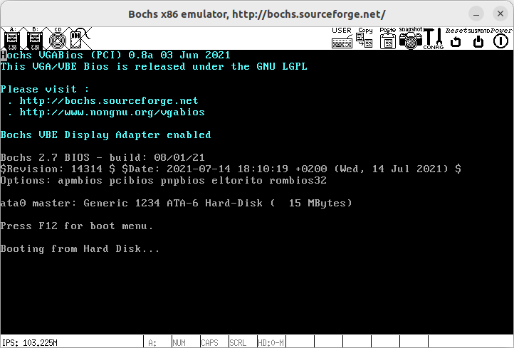
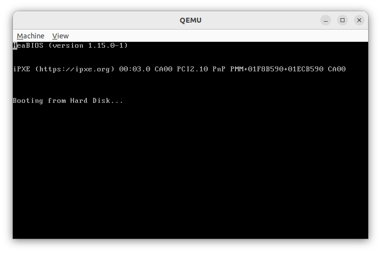

# 第一行代码
本章目标：虚拟硬盘第512字节处为0x55,0xaa。在bochs和qemu的虚拟机上显示一个字符'H'，

创建虚拟硬盘

```
    bximage -q -hd=16 -func=create -sectsize=512 -imgmode=flat virtual_disk.img
```
如果不能成功运行，输入biximage后按照上述选项创建硬盘，看见virtual_disk.img文件就成功了

配置bochs
命令行输入bochs, 4. Save options to...,配置文件名bochsrc
修改bochsrc 
display_library: x,options="gui_debug"
boot:disk
ata0-master: type=disk, path="./build/virtual_disk.img", mode=flat

## x86_32位机器初始状态
计算机加电后首先运行bios中设定好的程序，cpu进入实模式，此时cpu只有20位地址线，地址分配内存具体分配细节请百度（接下来这里我们主要用到0xB8000~0xBFFFF，这块区域用于文本显示,0x7c00~0x7DFF加载我们的初始代码，0x7E00~0x9FBFF存放接下来的代码，总共三块内存区域）。
需要注意在0xF0000~0xFFFFF这块区域，biso为我们提供了一系列的功能用来操作硬件，我们按使用说明配置好相应寄存器后，就可以使用“int 数字”来使用相应功能。

分配内存后，bios将运行初始化程序，然后将 cs:ip指向0:0x7c00。我们的程序符合MBR规范的话，将从硬盘0盘0道1扇区被加载至这一区域运行（0x7C00~0x70FF）。

MBR规范是什么：如果扇区末尾最后两个字节是0x55,0xAA则认为是MBR。

boot.S编译
```
    nasm -f bin -o ../build/boot.bin ./boot/boot.S
```

如何将编译后的二进制文件写入虚拟硬盘0盘0道1扇区
使用dd命令，bs表示块大小，count表示数量，conv表示如何转化文件，这里使用notrunc
```
    dd if=../build/boot.bin of=../build/virtual_disk.img bs=512 count=1 conv=notrunc
```

然后使用在bochsrc文件目录下使用bochs -q即可运行bochs,将看到如下画面



第一行已经出现'H',其他内容为bochs的bios中的代码。

在makefile文件夹中使用make qemu命令可查看qemu运行结果 


